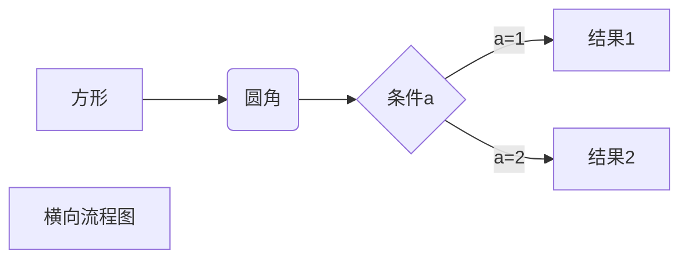
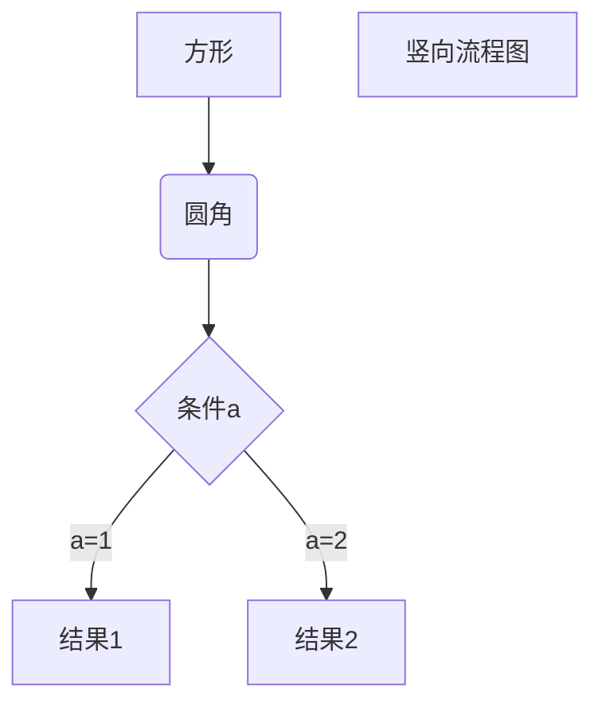
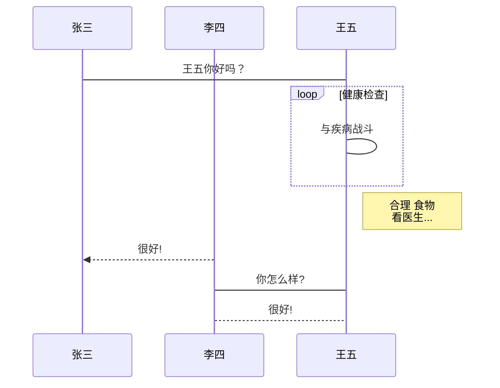
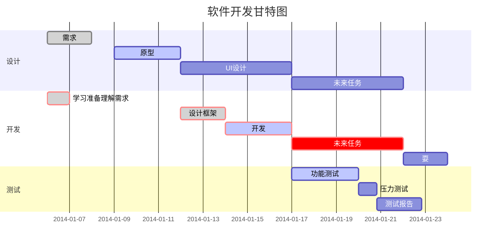

<span id="begin"></a>
**锚点目标：**


本**md2html**工具所支持的markdown语法如下。

# Markdown 标题


使用 **#** 号可表示 1-6 级标题，一级标题对应一个 **#** 号，二级标题对应两个 **#** 号，以此类推。

```
# 一级标题
## 二级标题
### 三级标题
#### 四级标题
##### 五级标题
###### 六级标题
```


# Markdown 段落

Markdown 段落没有特殊的格式，直接编写文字就好，**段落的换行是使用两个以上空格加上回车**。


当然也可以在段落后面使用一个空行来表示重新开始一个段落。


## 字体

Markdown 可以使用以下几种字体：

*斜体文本*
**粗体文本**
***粗斜体文本***
```plaintext
*斜体文本*
**粗体文本**
***粗斜体文本***
```


## 分隔线

<font color=red>不支持</font>

## 删除线

如果段落上的文字要添加~删除线~，只需要在文字的两端加上两个波浪线 **~~** 即可，实例如下：

```
~BAIDU.COM~
```

## 下划线

<u>下划线可以通过</u> HTML 的 **** 标签来实现：

```
<u>带下划线文本</u>
```


## 脚注

<font color=red>不支持</font>

# Markdown 区块

Markdown 区块引用是在段落开头使用 **>** 符号 ，然后后面紧跟一个**空格**符号：

```
> 区块引用
> 菜鸟教程
> 学的不仅是技术更是梦想
```
> 区块引用
> 菜鸟教程
> 学的不仅是技术更是梦想


另外区块是可以嵌套的，一个 **>** 符号是最外层，两个 **>** 符号是第一层嵌套，以此类推退：

```
> 最外层
> > 第一层嵌套
> > > 第二层嵌套
```
> 最外层
> > 第一层嵌套
> > > 第二层嵌套


## 区块中使用列表

区块中使用列表实例如下：

```
> 区块中使用列表
> 1. 第一项
> 2. 第二项
> + 第一项
> + 第二项
> + 第三项
```

> 区块中使用列表
> 1. 第一项
> 2. 第二项
> + 第一项
> + 第二项
> + 第三项


## 列表中使用区块

如果要在列表项目内放进区块，那么就需要在 **>** 前添加四个空格的缩进。

区块中使用列表实例如下：

```
* 第一项
    > 菜鸟教程
    > 学的不仅是技术更是梦想
* 第二项
```
* 第一项
    > 菜鸟教程
    > 学的不仅是技术更是梦想
* 第二项


# Markdown 代码

如果是段落上的一个函数或片段的代码可以用反引号( \` )把它包起来，例如： `printf()` 函数

```
`printf()` 函数
```

### 代码区块

用 **```** 包裹一段代码，并指定一种语言（也可以不指定）：

```javascript
$(document).ready(function () {
    alert('RUNOOB');
});
```

# Markdown 链接

链接使用方法如下：

```
[链接名称](链接地址)
```

例如：

```
这是一个链接 [菜鸟教程](https://www.runoob.com)
```
这是一个链接 [菜鸟教程](https://www.runoob.com)

### 高级链接

```
链接也可以用变量来代替，文档末尾附带变量地址：
这个链接用 1 作为网址变量 [Google][1]
这个链接用 runoob 作为网址变量 [Runoob][runoob]
然后在文档的结尾为变量赋值（网址）

  [1]: http://www.google.com/
  [runoob]: http://www.runoob.com/
```
链接也可以用变量来代替，文档末尾附带变量地址：
这个链接用 1 作为网址变量 [Google][1]
这个链接用 runoob 作为网址变量 [Runoob][runoob]
然后在文档的结尾为变量赋值（网址）

  [1]: http://www.google.com/
  [runoob]: http://www.runoob.com/

# Markdown 图片

Markdown 图片语法格式如下：

```


```

- 开头一个感叹号 !
- 接着一个方括号，里面放上图片的替代文字
- 接着一个普通括号，里面放上图片的网址，最后还可以用引号包住并加上选择性的 'title' 属性的文字。（鼠标悬置图片上方数秒显示）

使用实例：

```


```


当然，你也可以像网址那样对图片网址使用变量:

```
这个链接用 3 作为网址变量 [RUNOOB][3].
然后在文档的结尾位变量赋值（网址）

[3]: http://static.runoob.com/images/runoob-logo.png
```
这个链接用 3 作为网址变量 [RUNOOB][3].
然后在文档的结尾位变量赋值（网址）

[3]: http://static.runoob.com/images/runoob-logo.png


Markdown 还没有办法指定图片的高度与宽度，如果你需要的话，你可以使用普通的 `` 标签。

```

```


# Markdown 表格

Markdown 制作表格使用 **|** 来分隔不同的单元格，使用 **-** 来分隔表头和其他行。

语法格式如下：

```
|  表头   | 表头  |
|  ----  | ----  |
| 单元格  | 单元格 |
| 单元格  | 单元格 |
```
|  表头   | 表头  |
|  ----  | ----  |
| 单元格  | 单元格 |
| 单元格  | 单元格 |


居中方式：`:`

```
|靠左|居中|靠右|
|:--|:-:|-:|
| 1 | 2 | 3 |
```

| 靠左 | 居中 | 靠右 |
| :--- | :--: | ---: |
| 1    |  2   |    3 |


# Markdown 高级技巧

### 支持的 HTML 元素

不在 Markdown 涵盖范围之内的标签，都可以直接在文档里面用 HTML 撰写。


```
使用 <kbd>Ctrl</kbd>+<kbd>Alt</kbd>+<kbd>Del</kbd> 重启电脑
```

输出结果为：

使用 <kbd>Ctrl</kbd>+<kbd>Alt</kbd>+<kbd>Del</kbd> 重启电脑

### 转义

Markdown 使用了很多特殊符号来表示特定的意义，如果需要显示特定的符号则需要使用转义字符，Markdown 使用反斜杠转义特殊字符：

```
**文本加粗** 
\*\* 正常显示星号 \*\*
```

**文本加粗** 
\*\* 正常显示星号 \*\*

Markdown 支持以下这些符号前面加上反斜杠来帮助插入普通的符号：

```
\   反斜线
`   反引号
*   星号
_   下划线
{}  花括号
[]  方括号
()  小括号
#   井字号
+   加号
-   减号
.   英文句点
!   感叹号
```

### 公式

当你需要在编辑器中插入数学公式时，可以使用两个美元符 $$ 包裹 TeX 或 LaTeX 格式的数学公式来实现。提交后，问答和文章页会根据需要加载 Mathjax 对数学公式进行渲染。如：

```
$$
\mathbf{V}_1 \times \mathbf{V}_2 =  \begin{vmatrix} 
\mathbf{i} & \mathbf{j} & \mathbf{k} \\[0.5em]
\frac{\partial X}{\partial u} &  \frac{\partial Y}{\partial u} & 0 \\[0.5em]
\frac{\partial X}{\partial v} &  \frac{\partial Y}{\partial v} & 0 \\
\end{vmatrix}
$$
```

$$
\mathbf{V}_1 \times \mathbf{V}_2 =  \begin{vmatrix} 
\mathbf{i} & \mathbf{j} & \mathbf{k} \\[0.5em]
\frac{\partial X}{\partial u} &  \frac{\partial Y}{\partial u} & 0 \\[0.5em]
\frac{\partial X}{\partial v} &  \frac{\partial Y}{\partial v} & 0 \\
\end{vmatrix}
$$

# 流程图

以下几个实例效果图如下：

**1、横向流程图源码格式：**(mermaid)




**2、竖向流程图源码格式：**




**3、标准流程图源码格式：**(flow)

```flow
st=>start: 开始框
op=>operation: 处理框
cond=>condition: 判断框(是或否?)
sub1=>subroutine: 子流程
io=>inputoutput: 输入输出框
e=>end: 结束框
st->op->cond
cond(yes)->io->e
cond(no)->sub1(right)->op
```


**4、标准流程图源码格式（横向）：**

```flow
st=>start: 开始框
op=>operation: 处理框
cond=>condition: 判断框(是或否?)
sub1=>subroutine: 子流程
io=>inputoutput: 输入输出框
e=>end: 结束框
st(right)->op(right)->cond
cond(yes)->io(bottom)->e
cond(no)->sub1(right)->op
```


**5、UML时序图源码样例：**

```plantuml
对象A->对象B: 对象B你好吗?（请求）
Note right of 对象B: 对象B的描述
Note left of 对象A: 对象A的描述(提示)
对象B-->对象A: 我很好(响应)
对象A->对象B: 你真的好吗？
```


**6、UML时序图源码复杂样例：**

```plantuml
Title: 标题：复杂使用
对象A->对象B: 对象B你好吗?（请求）
Note right of 对象B: 对象B的描述
Note left of 对象A: 对象A的描述(提示)
对象B-->对象A: 我很好(响应)
对象B->小三: 你好吗
小三-->>对象A: 对象B找我了
对象A->对象B: 你真的好吗？
Note over 小三,对象B: 我们是朋友
participant C
Note right of C: 没人陪我玩
```


**7、UML标准时序图样例：**




**8、甘特图样例：**




# MarkDown 锚点

MarkDown中实现页面跳转的方法如下：

1. 定义锚点目标；锚点目标的定义方式有4种：类Setext形式的标题、类atx形式的标题、带id特性的HTML标签（id特性的值为`目标内容`）、带name特性的a标签（name特性的值为`目标内容`）；
2. 定义锚点；锚点的定义方式有3种：行内式链接、参考式链接、HTML的a链接；

**说明：**

- 锚点 和 锚点目标 的定义不分先后顺序；

**注意：**

- [锚点](#锚点的定义)的 `目标内容` 中不能有大写字母和空格，所以如果锚点目标的 `目标内容` 中有大写字母或空格，则需要在定义锚点中的 `目标内容` 时，把大写字母改成小写字母，把空格改成 `-`；
- 锚点的 目标内容中不能含有以下字符：
  - 半角点(即英文中的句号)`.`
- 标签形式的锚点目标的id特性值中是不能含有中文字符；
- `name` 特性只能应用在 a 标签上；
- HTML5不支持通过a标签的 `name` 特性来定义锚点目标；
- `HTML锚点` 的目标锚点只能是 [标签形式的锚点目标](#标签形式的锚点目标)
- 用`span`定义不可视的锚点


## 示例

```
<span id="begin"></a>
[跳转到开头](#begin)
```

**锚点：**

[跳转到开头](#begin)
